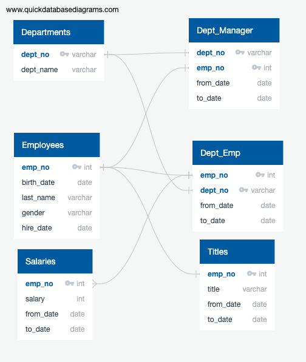
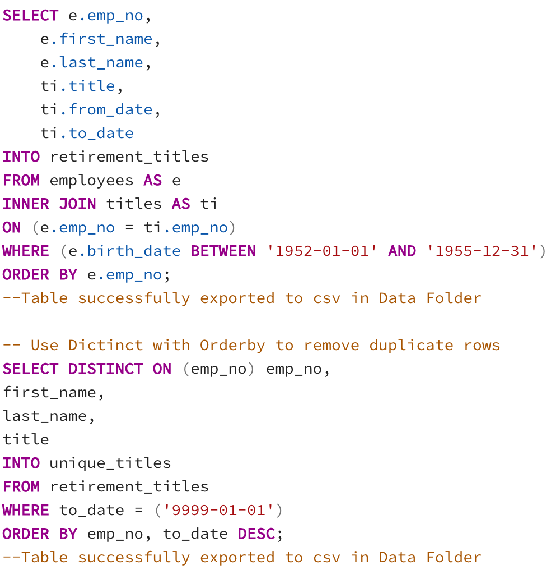
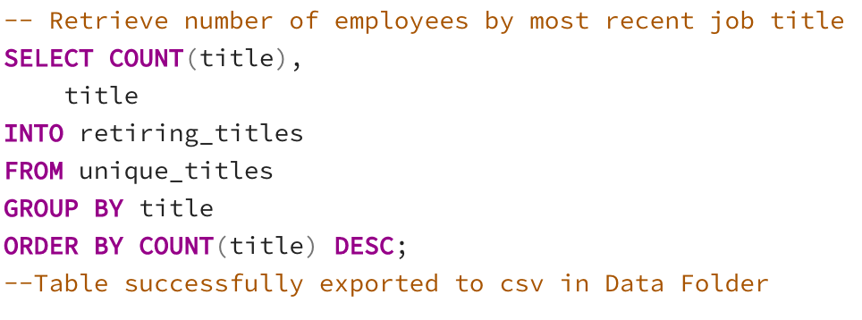
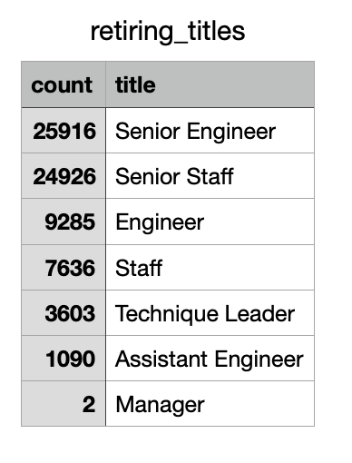
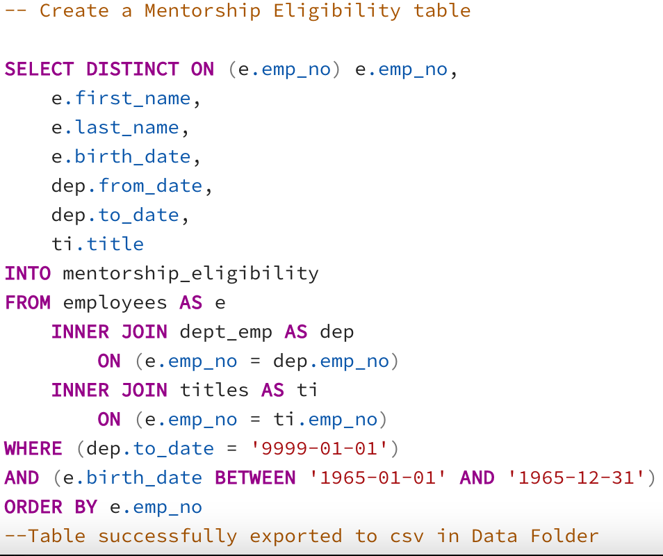

# Pewlett-Hackard-Analysis

## Overview/Purpose of the analysis: 
   * The purpose of this report is to better prepare Bobby's manager for the upcoming "silver tsunami." By leveraging SQL (pgAdmin), we were able to determine the number of retiring employees per title and identified the employees who are eligible to participate in a mentorship program. 
   * Of note, In order to ensure we stayed organized and maintained a clear understanding of the relationship between each spreadsheet, we continously referenced the Entity Relationship Diagram (ERD) we initially created (pictured below). This diagram proved to be essential in the table creation process since primary keys and foreign keys needed to be designated properly.    
     
   
## Results: 
   * Deliverable 1: Determining the number of retiring employees per title
     * In order to determine the number of retiring employees per title, we first created a SQL table named "retirement_tables" which combined pertinent data from the "employees" and "titles" tables such as employee number, last name, first name, titles, etc and extracted only the birth dates between 1952 and 1955. The table was then exported as a csv. Immediately after, we created another table named "unique_titles" that would exclude duplicate rows and created another csv. See below.
      
     * Finally, from the "unique_titles" table we retrieved the number of retiring employees by most recent job title and created a new table and csv named "retiring_titles." Below is the code along with an image of the csv export. 
        
        
       * Analysis: There are a total of 72,458 employees retiring. Senior Engineers and Senior Staff account for a combined 70.2% out of that total which is significantly high. Conversely, there are only 2 managers eligible for retirement. 
     
   * Delverable 2: Identifying the employees eligible to participate in a mentorship program
     * In order to identify the employees who are eligible to participate in a mentorship program, we created a SQL table named "mentorship_eligibility" which combined data from the employees, dept_emp and titles tables. We also filtered birth dates that were only within the year 1965. The table was then exported to a csv. See below image of the code we used. 
       

## Summary: 
   * How many roles will need to be filled as the "silver tsunami" begins to make an impact?
     * 
   * Are there enough qualified, retirement-ready employees in the departments to mentor the next generation of Pewlett Hackard employees?
